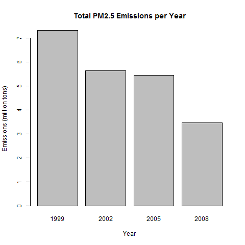
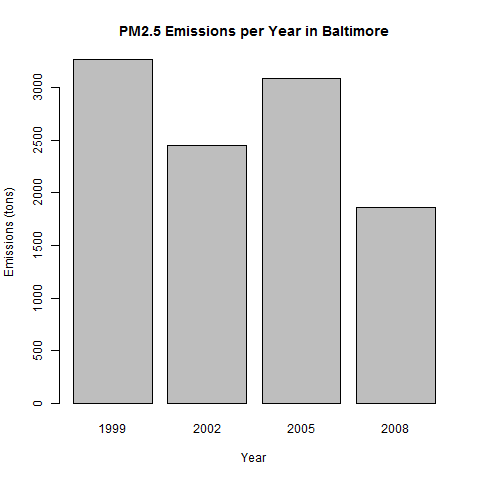
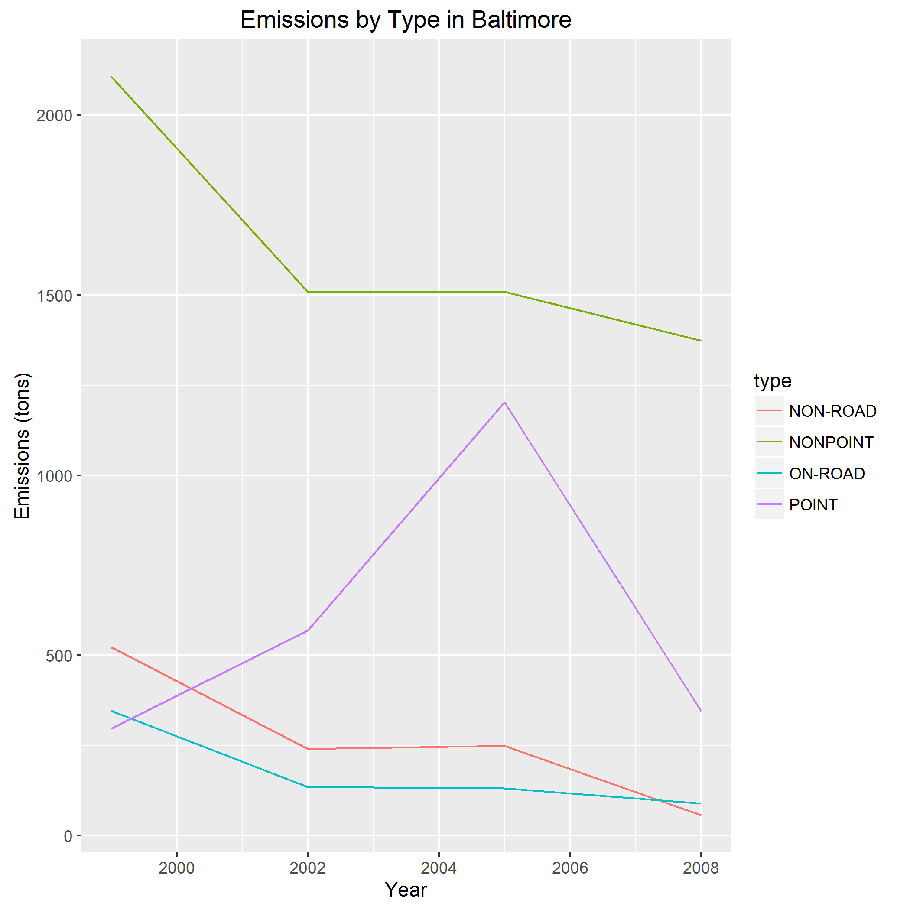
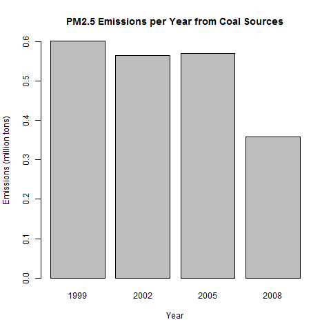
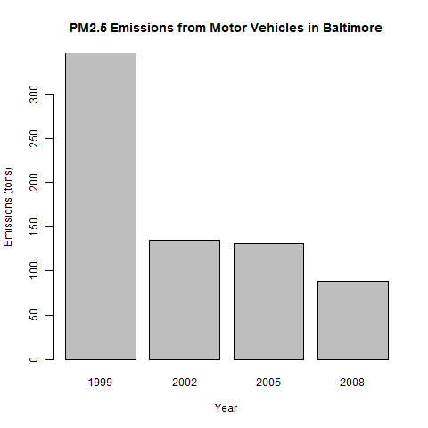
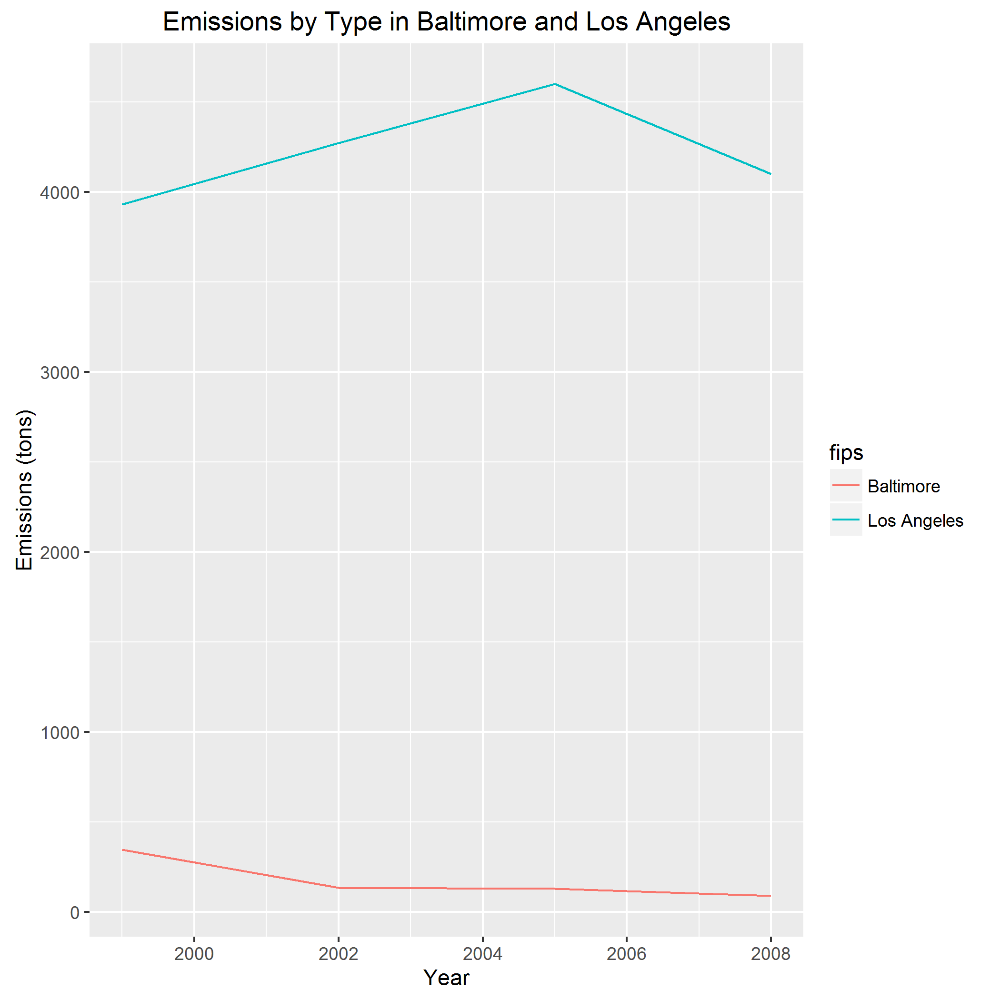

# NEI: Exploratory Data Analysis

## Introduction

Data is taken from [National Emissions Inventory](https://www.epa.gov/air-emissions-inventories). Graphs are created using the base package and [ggplot2](http://ggplot2.org/) package.

Graphs are created to address the following questions:

1. Have total emissions from PM2.5 decreased in the United States from 1999 to 2008?
2. Have total emissions from PM2.5 decreased in the Baltimore City, Maryland (fips == "24510") from 1999 to 2008?
3. Of the four types of sources indicated by the type (point, nonpoint, onroad, nonroad) variable, which of these four sources have seen decreases in emissions from 1999–2008 for Baltimore City? Which have seen increases in emissions from 1999–2008?
4. Across the United States, how have emissions from coal combustion-related sources changed from 1999–2008?
5. How have emissions from motor vehicle sources changed from 1999–2008 in Baltimore City?
6. Compare emissions from motor vehicle sources in Baltimore City with emissions from motor vehicle sources in Los Angeles County, California (fips == "06037"). Which city has seen greater changes over time in motor vehicle emissions?

To run the scripts,

1. Put the R files in this repository in your working directory.
2. Type `source("plot1.R")`.
3. The plot `plot1.png` will be generated in your working directory.
4. Repeat for other files.

The scripts will do the following:

1. Load the [ggplot2](http://ggplot2.org/) package. Install it if not installed.
2. Download the data into your working directory. There will be two files: `Source_Classification_Code.rds` and `summarySCC_PM25.rds`.
3. Read the data from `summarySCC_PM25.rds` into a variable called `NEI`. Read the data from `Source_Classification_Code.rds` into a variable called `SCC`. This step will take some time.
4. Get the subset of data that relates to the question.
5. Aggregate the data. Get the sum of emissions for each year.
6. Plot the data.

----------

## Results

Have total emissions from PM2.5 decreased in the United States from 1999 to 2008?

Have total emissions from PM2.5 decreased in the Baltimore City, Maryland (fips == "24510") from 1999 to 2008?

Of the four types of sources indicated by the type (point, nonpoint, onroad, nonroad) variable, which of these four sources have seen decreases in emissions from 1999–2008 for Baltimore City? Which have seen increases in emissions from 1999–2008?

Across the United States, how have emissions from coal combustion-related sources changed from 1999–2008?

How have emissions from motor vehicle sources changed from 1999–2008 in Baltimore City?

Compare emissions from motor vehicle sources in Baltimore City with emissions from motor vehicle sources in Los Angeles County, California (fips == "06037"). Which city has seen greater changes over time in motor vehicle emissions?

----------

Course project for [Exploratory Data Analysis](https://www.coursera.org/learn/exploratory-data-analysis/).
